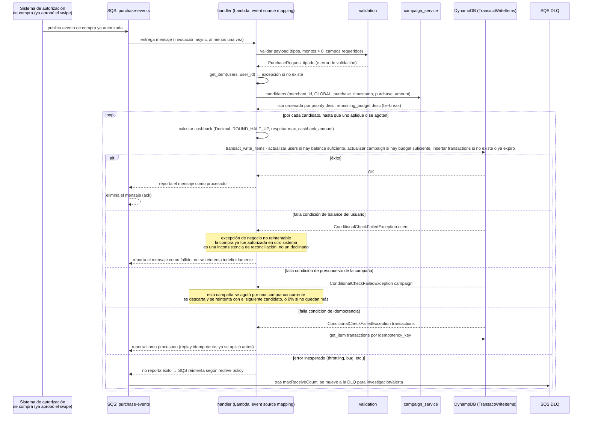
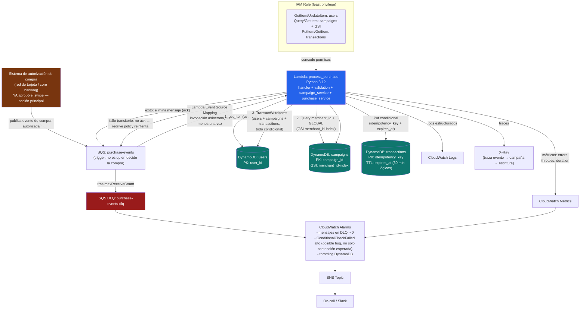

# Módulo de Cashbacks — Spec de Diseño y Plan de Acción

Estado: **borrador para acordar** (SDD — este documento es el spec; el código se implementa después de confirmarlo).

## 0. Decisiones ya acordadas

| Decisión | Elegido | Nota |
|---|---|---|
| Stacking de campañas | Prioridad explícita (`priority`, no necesariamente la tasa más alta) | Da control de negocio total sobre qué campaña gana en un solapamiento |
| Identidad de merchant | No existe hoy → se agrega `merchant_id` al evento de compra | Requiere coordinación con quien emite el evento (procesador de tarjeta) |
| Idempotencia | Idempotency key provista por el caller | Patrón estándar en sistemas de pagos |
| Arquitectura | Una sola Lambda, módulos internos separados | Sin latencia extra entre Lambdas; testeable por capas |
| Tie-break de prioridad igual | Gana la campaña con más `remaining_budget` (saldo restante) | Requiere que las campañas tengan presupuesto propio (§3) |
| Reuso de idempotency key | Mismo key + mismo body → replay idempotente. Mismo key + body distinto **dentro de la ventana corta** → conflicto (rechazar). Mismo key + body distinto **después de la ventana** → transacción nueva, válida | Se implementa con TTL nativo de DynamoDB (§4) |
| Moneda | Solo USD, sin campo `currency`, sin conversión | Confirmado — fuera de alcance multi-moneda |
| Administración de campañas | Fuera de alcance. Se asume que `campaigns` ya existe y se administra en otro sistema; esta Lambda solo lee | No se diseña CRUD |
| Trigger de la Lambda | Evento asíncrono (SQS), no una llamada síncrona tipo API Gateway | La compra ya fue autorizada en tiempo real por el sistema de tarjetas/red de pago (fuera de este alcance); esta Lambda reacciona *después* para reconciliar el ledger interno (balance + cashback). No es la acción principal, es un efecto secundario disparado por ella |

## 1. CAP: por qué esto es CA, no AP

La etiqueta "DynamoDB es AP" describe dos modos específicos que este diseño evita a propósito: (a) lecturas eventualmente consistentes, y (b) Global Tables multi-región (replicación async, last-writer-wins). Ninguno de los dos está en el camino crítico del balance.

Dentro de una sola región, cada `partition key` de DynamoDB tiene un único líder que serializa los writes y los replica sincrónicamente a un quórum antes de confirmar. Por eso `ConditionExpression` y `TransactWriteItems` son atómicos y estrictamente consistentes por partición — no dependen de ninguna lectura previa hecha por la Lambda, se evalúan contra el valor comprometido más reciente en el servidor. Para este patrón de uso, DynamoDB de una sola región se comporta como CA, no como AP:

- **Consistencia**: toda escritura de balance usa `ConditionExpression` sobre `main_balance` o `TransactWriteItems`. Nunca se escribe basado en un valor leído previamente sin que el condicional lo revalide server-side.
- **Disponibilidad**: se sacrifica al mínimo — si la condición falla (fondos insuficientes) o hay throttling, la request falla explícitamente (400/500) en vez de aceptar una escritura potencialmente inconsistente.
- **Partición**: el diseño es de una única tabla, una región, sin Global Tables. Si se necesitara multi-región activo-activo en el futuro, este documento ya no aplicaría tal cual (eso sí forzaría AP con last-writer-wins).

Alternativa considerada y descartada: una base relacional (Aurora/RDS) da el mismo resultado con un modelo mental más simple (`UPDATE ... WHERE balance >= amount` en una transacción + constraint único en `idempotency_key`), pero Lambda + RDS tiene un problema operativo real a alto volumen: agotamiento de conexiones (requiere RDS Proxy como capa adicional). DynamoDB es HTTP/serverless y no tiene ese límite, que es justo el escenario de alto volumen del enunciado. El único costo de `TransactWriteItems` es ~2x el costo de escritura normal (WCUs), aceptable por la garantía que da.

## 2. Fix central de los bugs de Parte 1

El problema #1 de la Parte 1 (race condition / lost update) se resuelve así, sin locks a nivel de aplicación:

```python
users_table.update_item(
    Key={'user_id': user_id},
    UpdateExpression="ADD main_balance :neg_amount, cashback_balance :cashback",
    ConditionExpression="main_balance >= :amount",
    ExpressionAttributeValues={
        ':neg_amount': -purchase_amount,
        ':cashback': cashback_earned,
        ':amount': purchase_amount,
    }
)
```

DynamoDB evalúa `ConditionExpression` de forma atómica contra el valor actual en el servidor, no contra lo que la Lambda leyó antes. Dos invocaciones concurrentes con balance ajustado ya no pueden hacer ambas la resta: la segunda falla con `ConditionalCheckFailedException` y se traduce a `400 insufficient funds`. Ya no hace falta ni siquiera el `get_item` inicial para decidir si hay fondos — el condicional lo resuelve en la escritura.

Esto se combina con `transact_write_items` (ver §4) para atar en la misma transacción la idempotencia.

## 3. Modelo de datos

### `users` (sin cambios de esquema)
Igual que hoy. Todas las escrituras pasan a ser condicionales (§2).

### `campaigns` (nueva)

| Atributo | Tipo | Notas |
|---|---|---|
| `campaign_id` (PK) | String | |
| `name` | String | |
| `merchant_id` | String | `"GLOBAL"` como sentinel para campañas que aplican a todo comercio |
| `category_code` | String (opcional) | Para futuro (ej: MCC de "cafeterías"), no requerido por el caso de uso actual |
| `cashback_rate` | Number (Decimal) | |
| `priority` | Number | Mayor gana en solapamiento |
| `min_purchase_amount` | Number (Decimal, opcional) | Reemplaza el `> 100` hardcodeado |
| `max_cashback_amount` | Number (Decimal, opcional) | Tope de cashback **por transacción**, si aplica |
| `total_budget` | Number (Decimal, opcional) | Presupuesto total de la campaña. Ausente = ilimitado |
| `remaining_budget` | Number (Decimal, requerido si `total_budget` existe) | Saldo restante; se decrementa atómicamente en cada compra que usa esta campaña. También es el criterio de desempate cuando dos campañas comparten `priority` |
| `start_datetime` / `end_datetime` | String ISO 8601 UTC | Límites inclusivos |
| `status` | String | `ACTIVE` \| `INACTIVE` \| `DRAFT` |
| `created_at`, `updated_at`, `created_by` | — | Auditoría (mantenidos por el sistema externo que administra campañas, no por esta Lambda) |

GSI `merchant_id-index` (PK=`merchant_id`): permite consultar en dos queries (merchant específico + `"GLOBAL"`) todas las campañas candidatas; el filtro por fecha/estado/prioridad se hace en memoria (el set de campañas activas por merchant es pequeño).

La regla actual (`purchase_amount > 100 → 5%`) se migra como **una fila más** en esta tabla: `merchant_id="GLOBAL"`, `min_purchase_amount=100`, `cashback_rate=0.05`, `priority=0` (la prioridad más baja, para que cualquier campaña específica la pueda superar), sin `total_budget` (ilimitado) y sin `end_datetime` (o una fecha muy lejana). Así todo el sistema queda campaign-driven, sin dos code paths distintos para "regla base" vs "campaña".

**Nota de alcance**: esta Lambda solo **lee y decrementa** `remaining_budget`. La creación, edición y carga inicial de campañas (incluida la fila `GLOBAL` de arriba) se asume administrada por un sistema externo — no se diseña un CRUD aquí (ver decisión en §0).

### `transactions` (nueva — ledger de idempotencia y auditoría)

| Atributo | Tipo | Notas |
|---|---|---|
| `idempotency_key` (PK) | String | Provisto por el caller |
| `user_id` | String | |
| `merchant_id` | String | |
| `purchase_amount` | Number | |
| `applied_campaign_id` | String (nullable) | Cuál campaña ganó, para auditoría |
| `cashback_rate_applied` | Number | |
| `cashback_earned` | Number | |
| `main_balance_after` | Number | |
| `cashback_balance_after` | Number | |
| `status` | String | `COMPLETED` \| `REJECTED_INSUFFICIENT_FUNDS` \| `REJECTED_INVALID` |
| `created_at` | String ISO 8601 | |

Esta tabla resuelve dos problemas de la Parte 1 a la vez: idempotencia (la PK es la key del caller) y falta total de auditoría/ledger.

**Ventana de idempotencia (TTL)**: agrego un atributo `expires_at` (epoch) a cada registro, **30 minutos** desde `created_at` (confirmado).

Nota técnica importante dado que la ventana es corta: el TTL nativo de DynamoDB borra el ítem en background, típicamente dentro de 48 horas, **no de forma inmediata al cumplirse `expires_at`**. Con una ventana de 30 minutos no podemos depender del borrado físico para "liberar" la key — el ítem viejo probablemente sigue ahí cuando alguien la reusa legítimamente a los 35 minutos. Por eso la condición de escritura no es solo `attribute_not_exists`, sino:

```
ConditionExpression = "attribute_not_exists(idempotency_key) OR expires_at < :now"
```

Esto permite que el `Put` tenga éxito tanto si no existe el ítem como si existe pero ya venció lógicamente (aunque DynamoDB todavía no lo haya borrado). Con esto:

- No existe o ya venció → se escribe como transacción nueva.
- Existe y sigue vigente (`expires_at >= now`) → la condición falla; ahí sí se hace `get_item` para decidir: mismo body → replay (resultado ya guardado); body distinto → conflicto (rechazar, log de posible bug upstream).

## 4. Cambios en el contrato del evento

La Lambda ya no recibe una request HTTP con body — recibe un **mensaje de SQS** cuyo body es el evento de compra, publicado por el sistema que ya autorizó la compra:

```json
{
  "idempotency_key": "b6e6c1f0-...-uuid-v4",
  "user_id": "u-123",
  "merchant_id": "mch-starbucks-001",
  "purchase_amount": "50.00",
  "purchase_timestamp": "2026-07-16T14:32:00Z"
}
```

Dos campos nuevos y por qué:

- `idempotency_key`: obligatorio, generado por el sistema que emite el evento (procesador de tarjeta), no por la Lambda. Cobra aún más importancia en un modelo de eventos: SQS entrega **al menos una vez**, así que duplicados no son un caso raro, son el comportamiento esperado del transporte.
- `purchase_timestamp`: obligatorio. **No usar `datetime.utcnow()` dentro del handler.** Si un mensaje se reintenta (redelivery de SQS) horas después, la resolución de campaña debe evaluarse contra el momento real de la compra, no contra el momento del reintento — si no, una compra del viernes podría "perder" la campaña de fin de semana al reintentarse el lunes, o peor, ganar una campaña a la que nunca debió aplicar.

Este cambio de contrato requiere coordinación con el sistema que hoy emite el evento (fuera del alcance de esta Lambda) — lo marco como dependencia externa, no como algo que resolvemos en este repo.

## 5. Flujo de la Lambda



Punto de diseño importante: si una campaña se queda sin `remaining_budget` justo cuando dos compras compiten por el último saldo, **el mensaje no debe fallar**. Se descarta esa campaña puntual y se reintenta con el siguiente candidato en la lista (o se aplica 0% si no queda ninguno). Un presupuesto de marketing agotado nunca debe bloquear la reconciliación de la compra real del usuario — eso sería tratar un problema de negocio (se acabó la promo) como si fuera un problema del cliente, que son cosas categóricamente distintas.

Otro punto que se deriva directamente de que esta Lambda ya no es la que autoriza la compra: **"fondos insuficientes" deja de ser un rechazo en tiempo real** (el swipe ya fue aprobado en otro sistema, con su propia validación de fondos) y pasa a ser una **excepción de reconciliación** — señal de que el ledger interno está desincronizado con lo que el sistema de tarjetas ya aprobó. Por eso no se reintenta indefinidamente vía SQS: se reporta como fallo no recuperable, se deja registro en `transactions` con `status=REJECTED_INSUFFICIENT_FUNDS`, y se alerta para revisión manual (§8), en vez de dejar que el redrive policy lo reintente hasta la DLQ como si fuera un error transitorio.

Estructura de módulos (para testabilidad, sin acoplar lógica a boto3 directamente):

```
lambda_function.py      # handler delgado: parsea el mensaje SQS, reporta éxito/fallo por registro (batch item failures)
validation.py           # parseo/validación tipada del evento, errores propios
models.py               # dataclasses: PurchaseRequest, CampaignRule, PurchaseResult
campaign_service.py     # resolución de campaña aplicable (recibe la tabla inyectada)
purchase_service.py     # orquesta: resolver campaña, calcular, transact_write_items
errors.py               # InvalidInputError, UserNotFoundError, InsufficientFundsError
```

## 6. Testing (Parte 3)

Pirámide:

1. **Unit tests puros** (sin AWS): resolución de campaña dado un set de campañas candidatas + timestamp + monto; cálculo y redondeo de cashback; validación de payload.
2. **Tests de integración con `moto`** (mock de DynamoDB): flujo completo del handler contra tablas simuladas.
3. **Test de concurrencia**: N threads invocando el handler simultáneamente con el mismo `user_id` y un balance ajustado para que solo una de las compras quepa — se verifica que exactamente una tenga éxito y el resto termine con la excepción de reconciliación por fondos insuficientes. Este test es el que prueba directamente el fix del bug #1.

### Edge cases que más me preocupan

- Límite exacto de la ventana de campaña (justo en `start_datetime`/`end_datetime`, timezone siempre UTC).
- Dos campañas con **la misma prioridad** activas para el mismo merchant — se resuelve por `remaining_budget` (§0), pero hay que testear el caso donde además empatan en budget (tie-break de tercer nivel, ej. `campaign_id` como desempate determinístico final).
- Monto negativo o cero (`purchase_amount <= 0`) — debe rechazarse, no sumar balance.
- `purchase_amount` no numérico o con más de 2 decimales.
- Reintento con el mismo `idempotency_key` y **distinto** `purchase_amount` **dentro de la ventana TTL** → debe rechazarse como conflicto; el mismo caso **después** de expirar el TTL → debe procesarse como transacción nueva (los dos comportamientos hay que testearlos por separado, incluyendo el borde justo en la expiración).
- Compra que agota el balance exactamente a 0 (borde de la condición `>=`).
- **Campaña que se queda sin `remaining_budget` a mitad de una ráfaga de compras concurrentes**: la compra debe seguir siendo exitosa cayendo a la siguiente campaña candidata (o a 0%), nunca fallar por esto. Test de concurrencia dedicado: N threads compitiendo por un `remaining_budget` que solo alcanza para M < N de ellas con la tasa de la campaña, y las N-M restantes deben terminar con el rate del siguiente candidato.
- Campaña sin `total_budget` (ilimitada) conviviendo con campañas limitadas en el mismo merchant.
- Redondeo de cashback a centavos (`ROUND_HALF_UP` consistente, no truncado).
- Usuario con `cashback_balance` faltante por datos legacy.
- Campaña editada/desactivada entre la lectura de campañas y el commit de la transacción (riesgo menor, no de integridad de balance — solo podría aplicar una campaña que expiró milisegundos antes; mitigable guardando `applied_campaign_id` en el ledger para reconciliación posterior, no bloqueante).

## 7. Plan de acción (orden de implementación)

1. `models.py` + `errors.py` — tipos y contratos, sin dependencias externas (testeable de inmediato).
2. `validation.py` — parseo del evento nuevo, unit tests de validación.
3. `campaign_service.py` — resolución de campaña, unit tests puros (sin AWS) con listas de campañas fabricadas.
4. `purchase_service.py` — orquestación con `transact_write_items`, tests con `moto`.
5. `lambda_function.py` — handler delgado que conecta todo (parsea mensajes SQS, reporta batch item failures), tests de integración end-to-end con `moto`.
6. Test de concurrencia (threads) sobre el flujo completo.
7. Script/migración de seed: insertar la campaña `GLOBAL` base (`min_purchase_amount=100`, `rate=0.05`, `priority=0`, sin `total_budget`) para no perder el comportamiento actual el día del corte.

Con la ventana de idempotencia confirmada en 30 minutos (§3), no quedan puntos abiertos. Puedo arrancar la implementación en el orden de arriba.

## 8. Diagrama de infraestructura



Notas sobre el diagrama:

- **La Lambda no es la acción principal.** El nodo marcado en marrón (`Core`) es donde realmente se decide y autoriza la compra (red de tarjeta / core banking), en tiempo real. `process_purchase` se dispara **después**, como reacción asíncrona al evento ya consumado, para reconciliar el ledger interno (balance + cashback). Por eso el trigger es una cola (SQS), no un API Gateway esperando una respuesta.
- **Con DLQ**, a diferencia de la versión anterior de este diagrama: ahora que la invocación es asíncrona vía SQS, un fallo transitorio (throttling, bug momentáneo) se reintenta automáticamente vía redrive policy, y tras agotar `maxReceiveCount` el mensaje se mueve a la DLQ para investigación y alerta, en vez de perderse.
- **"Fondos insuficientes" no se reintenta en la DLQ como si fuera transitorio**: como se explica en §5, es una excepción de reconciliación (la compra ya fue aprobada en otro sistema), así que la Lambda la reporta como fallo no recuperable y la deja auditada en `transactions`, no la deja rebotando hasta la DLQ.
- **X-Ray y CloudWatch Alarms** están para cerrar el gap de observabilidad que señalé en la Parte 1 (el `print()` original no daba ninguna visibilidad real). La alarma de `ConditionalCheckFailed` no es "no debería fallar nunca" — fallos ocasionales por contención de campaña o balance son esperados y correctos; la alarma es para detectar una tasa anormalmente alta, que sí sería señal de un bug o de un ataque.
- **IAM Role** con permisos mínimos por tabla (no `dynamodb:*`): la Lambda nunca debería tener permiso de `DeleteItem` en ninguna tabla, por ejemplo.
